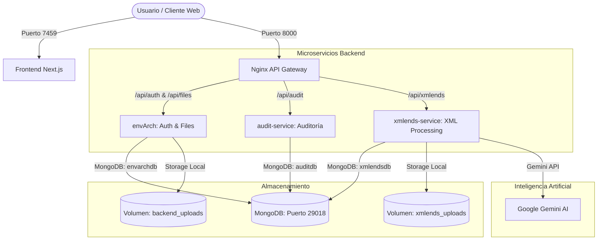

# G.A.C - Sistema de Gestión de Archivos Corporativos

G.A.C (Gestión de Archivos Corporativos) es una solución empresarial basada en **microservicios** para la administración, carga, descarga y análisis de archivos corporativos seguros, complementada con un portal web y procesamiento inteligente asistido por IA.

---

## 🏗️ Arquitectura del Sistema

El sistema está diseñado bajo un esquema de microservicios e integrado a través de un Gateway reverso (Nginx). Todos los servicios se orquestan fácilmente mediante Docker Compose.



---

## 📁 Estructura del Proyecto

El repositorio está estructurado en los siguientes módulos principales:

* **[`gateway/`](file:///c:/Users/david.albino/Proyectos/WEB/Monolito/Springboot/ComplementoActualitodo/gateway)**: Configuración del API Gateway basado en Nginx ([`gateway.conf`](file:///c:/Users/david.albino/Proyectos/WEB/Monolito/Springboot/ComplementoActualitodo/gateway/gateway.conf)).
* **[`envArch/`](file:///c:/Users/david.albino/Proyectos/WEB/Monolito/Springboot/ComplementoActualitodo/envArch)**: Microservicio encargado de la autenticación de usuarios (JWT) y el ciclo de vida de archivos corporativos (subidas, descargas, renombrados, reemplazos, borrados y parser de binarios).
* **[`auditService/`](file:///c:/Users/david.albino/Proyectos/WEB/Monolito/Springboot/ComplementoActualitodo/auditService)**: Microservicio encargado del registro de logs históricos y auditoría de eventos de seguridad.
* **[`xmlendsService/`](file:///c:/Users/david.albino/Proyectos/WEB/Monolito/Springboot/ComplementoActualitodo/xmlendsService)**: Microservicio especializado en análisis de XML y conexión con modelos de lenguaje de Gemini AI.
* **[`frontend/`](file:///c:/Users/david.albino/Proyectos/WEB/Monolito/Springboot/ComplementoActualitodo/frontend)**: Aplicación web responsiva moderna construida con Next.js y TypeScript.

---

## 🛠️ Especificaciones de los Servicios

| Servicio | Tecnología | Puerto (Local) | Puerto (Docker) | Descripción / Función |
| :--- | :--- | :--- | :--- | :--- |
| **API Gateway** | Nginx | `8000` | `8000` | Punto de entrada del API. Rutea peticiones al backend respectivo. |
| **envArch** | Spring Boot 3.5 (Java 21) | `10100` | `10100` | Gestión de usuarios, sesiones JWT y persistencia lógica/física de archivos. |
| **auditService**| Spring Boot (Java 21) | `10101` | `10101` | Log de auditoría de eventos asíncronos en la plataforma. |
| **xmlendsService**| Spring Boot (Java 21)| `10102` | `10102` | Análisis de metadatos XML e integraciones inteligentes con Gemini API. |
| **Frontend** | Next.js 15 (TypeScript) | `9000` / `7459`| `7459` | Interfaz gráfica de usuario optimizada para la administración de archivos. |
| **Database** | MongoDB 7.0 | `29018` | `29018` | Base de datos documental compartida para persistencia de metadatos. |

---

## 🚀 Guía de Inicio Rápido (Docker Compose)

La forma más rápida de ejecutar todo el ecosistema es usando Docker Compose. Asegúrate de tener instalado **Docker** y **Docker Compose**.

1. **Configurar Variables de Entorno**:
   Crea o verifica un archivo `.env` en la raíz del proyecto para colocar tu API Key de Gemini:
   ```env
   GEMINI_API_KEY=tu_api_key_aqui
   ```

2. **Iniciar la Plataforma**:
   Ejecuta el siguiente comando en la raíz del proyecto:
   ```bash
   docker-compose up -d --build
   ```

3. **Acceder a la Aplicación**:
   * **Frontend Web**: Abre [http://localhost:7459](http://localhost:7459) en tu navegador.
   * **API Gateway**: Disponible en [http://localhost:8000](http://localhost:8000).

4. **Detener la Plataforma**:
   ```bash
   docker-compose down
   ```

---

## 💻 Desarrollo Local (Sin Docker para Backends)

Si deseas ejecutar y desarrollar los microservicios de Spring Boot directamente en tu máquina:

### Requisitos Previos
* **Java Development Kit (JDK) 21** o superior.
* **Node.js** v18+ (para el frontend).
* **MongoDB** corriendo en el puerto `29018`. Puedes arrancar solo la base de datos con docker:
  ```bash
  docker-compose up -d mongodb
  ```

### Ejecutar Servicios Backend (Spring Boot)
Usa el wrapper de Maven (`mvnw`) incluido en el proyecto:

```powershell
# Levantar el servicio envArch (Auth & Files)
.\mvnw.cmd spring-boot:run -pl envArch

# Levantar el servicio de auditoría
.\mvnw.cmd spring-boot:run -pl auditService

# Levantar el servicio de XML processing
.\mvnw.cmd spring-boot:run -pl xmlendsService
```

### Ejecutar Frontend (Next.js)
```bash
cd frontend
npm install
npm run dev
```
La aplicación web estará disponible en [http://localhost:9000](http://localhost:9000).

---

## 🧪 Ejecución de Pruebas Unitarias

Para correr las suites completas de pruebas unitarias configuradas para la lógica de negocio (usando JUnit 5 y Mockito):

```powershell
# Correr tests unitarios de envArch (excluyendo tests de contexto de base de datos)
.\mvnw.cmd test -pl envArch "-Dtest=!EnvArchApplicationTests"

# Correr todos los tests del proyecto completo
.\mvnw.cmd test
```
